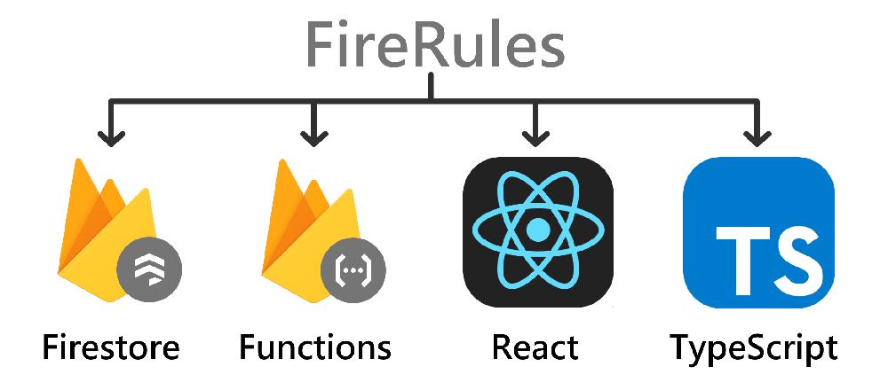

# FireRules

A standard JSON config to automate all systems except the high level UI. Generating and automaticly deploying to services of Google Cloud Platform (Firebase). So handle what data you need and FireRules will handle the rest, and help make development easy.

This library is used to automate many of the services of a personal side product Olympus to simplify, secure and steamline the development process. I am working on more librarys that will utitise this including, React.js/React Native Console Toolkit.

FireRules handles the database (Firestore) structure, securely, and taking advance of the customisable restricted access of this data. Automatically generating endpoints (Firebase Functions) to access and modify the data. Also provides major TypeScript support is the main focus so types and interaction classes are generated automatically to be used within your front-end products. 

